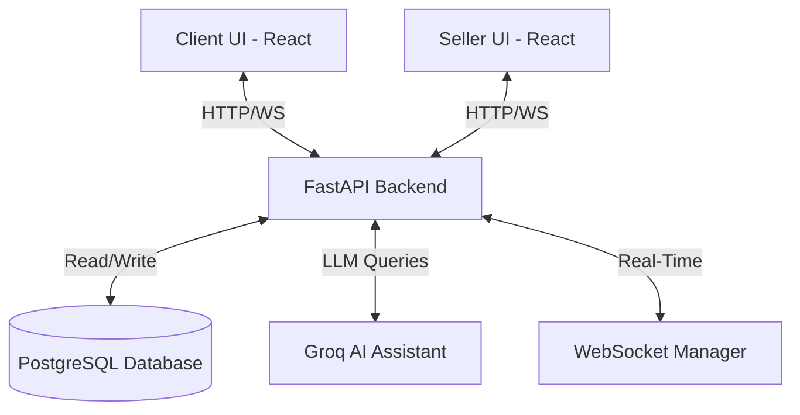
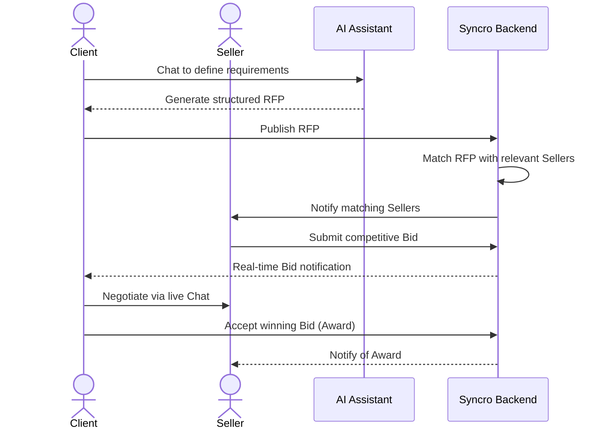

# Syncro – Universal Reverse Auction Marketplace

**Course:** CO2060 – Second Year Project  
**University:** (University of Peradeniya)  
**Team:** CodeBuds  
**Project Type:** Full Stack Web Application  

---

## 1. Project Overview

Syncro is a dual-role marketplace platform that implements a Reverse Auction model.  
Instead of sellers listing products and waiting for buyers, clients post Requests for Proposals (RFPs) describing their needs. Sellers receive notifications based on their niche and submit competitive bids.

The system reduces buyer search cost and helps sellers reach high-intent customers efficiently.

---

## 2. Problem Statement

In traditional e-commerce:
- Buyers waste time searching across multiple platforms.
- Sellers spend money on passive marketing.
- No unified system allows real-time competitive responses to buyer needs.

Syncro bridges this discovery gap.

---

## 3. Core Features

### Phase 1 – Direct Marketplace
- User authentication (JWT)
- Dual-role accounts (Client / Seller)
- Seller storefront creation
- Direct order placement
- Real-time messaging (WebSockets)
- Intelligent RFP assistance (AI-guided input)

### Phase 2 – Reverse Auction
- Smart RFP posting system
- Seller lead feed
- Competitive bidding engine
- Real-time bid updates
- Commission calculation logic
- Intelligent RFP assistance (AI-guided input)

---

## 4. Technology Stack

Frontend:
- Next.js / React

Backend:
- FastAPI (Python)

Database:
- PostgreSQL

Real-Time:
- Socket.io / WebSockets

---

## 5. System Architecture

The Syncro platform utilizes a modern, decoupled architecture designed for scalability and real-time performance:

- **Frontend (Client UI):** A responsive web application built with React, delivering tailored dashboards for both Clients and Sellers.
- **Backend API (Server):** A high-performance REST API built with Python and FastAPI, handling business logic, authentication, and routing.
- **Database Engine:** PostgreSQL serves as the core relational database, ensuring secure storage of user profiles, storefronts, RFPs, and bidding histories.
- **Real-Time Engine:** WebSocket integration facilitates instant updates for live chat messaging and real-time bidding without page reloads.
- **AI Assistant:** Integration with Groq API (LLM) provides an intelligent conversational agent that helps clients extract and formulate well-structured RFPs.
- **Cloud Infrastructure:** The system is fully containerized via Docker for reliable local development and configured for production deployment on Azure Cloud (Azure App Service and Azure Database for PostgreSQL).



---

## 6. System Workflow

The core Reverse Auction process follows a streamlined lifecycle:

1. **Onboarding:** Users authenticate securely via JWT and establish their roles. Sellers configure their profiles and define their service niches.
2. **AI-Guided RFP Creation (Client):** Instead of manually filling out complex forms, clients interact with an AI assistant. The AI clarifies requirements and automatically structures a comprehensive Request for Proposal (RFP).
3. **Targeted Distribution (System):** The backend processes the published RFP and instantly pushes it to the lead feeds of relevant sellers based on skill and niche matching.
4. **Competitive Bidding (Seller):** Sellers analyze the RFP and submit customized, competitive bids directly to the client.
5. **Real-Time Negotiation (Client & Seller):** Clients receive live bid updates. They can evaluate offers side-by-side and utilize the integrated real-time messaging system to negotiate details or clarify scope.
6. **Selection & Fulfillment (Client):** The client selects the optimal bid, formally awarding the project and placing a direct order with the winning seller.



---

## 7. Repository Structure

- `code/`: Contains the source code for the FastAPI backend and React frontend.
- `database/`: Holds the PostgreSQL schema designs, ER diagrams, and initialization scripts.
- `docs/`: Stores project documentation, including the proposal and design specifications.

---

## 8. How to Run Locally

To run the entire full-stack application (Frontend, Backend, and Database) at once, ensure Docker Desktop is running on your machine.

1. **Environment Setup:** From the root repository directory (`SYNCRO-2YP`), copy the template environment file to a new `.env` file:
   ```bash
   cp .env.example .env
   ```

2. **Start Docker Containers:** Run the following command:
   ```bash
   docker-compose up -d --build
   ```

Once the containers are built and running, you can access the application at:
- **Frontend UI:** http://localhost:5173
- **Backend API Docs:** http://localhost:8000/docs
- **Database:** Connect via `localhost:5433` (Use the credentials defined in your `.env` file)
